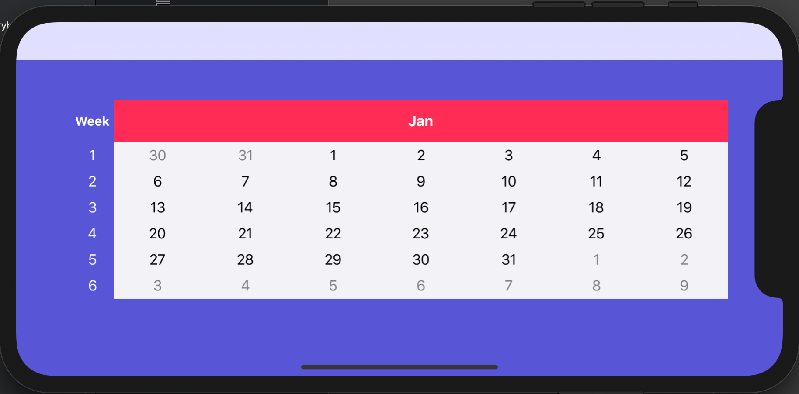
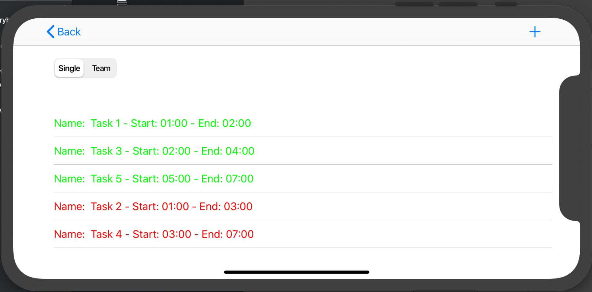
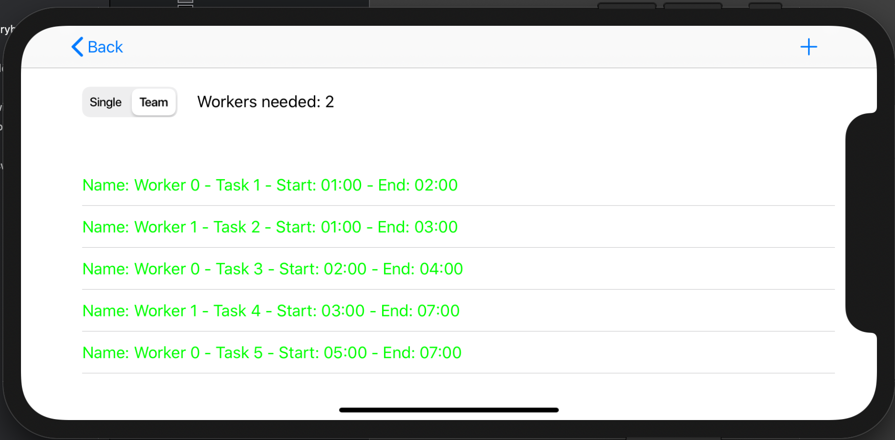

# Agendador de Serviços

**Número da Lista**: 3 
**Conteúdo da Disciplina**: Algoritmos Ambiciosos 

## Alunos
|Matrícula | Aluno |
| -- | -- |
| 17/0019098  |  Matheus Felizola Freires |
| 15/0016310  |  Luis Gustavo Avelino |

## Sobre 
O objetivo do projeto é servir como um agendador de serviços para profissionais autônomos. Nele o profissional autônomo pode cadastrar os serviços que deve realizar e após isso ele escolhe se quer realizá-las sozinhos, nesse caso o aplicativo escolhe a maior combinação possível de serviços combináveis, ou em equipe, nesse caso o aplicativo diz quantas pessoas o profissional precisaria contratar para realizar todas as atividades.

## Screenshots

## Instalação 
**Linguagem**: Swift 
**Framework**: UIKit e JTAppleCalendar 

**Pré-requisitos**: XCode 10 ou superior.

## Uso 
1. Escolher um dia no calendário
2. Adicionar tarefas nesse dia
3. Escolher o método de realização (sozinho ou em equipe)

